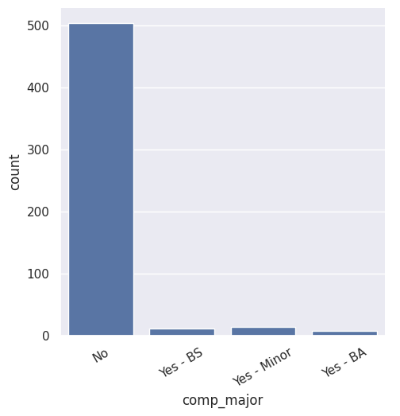
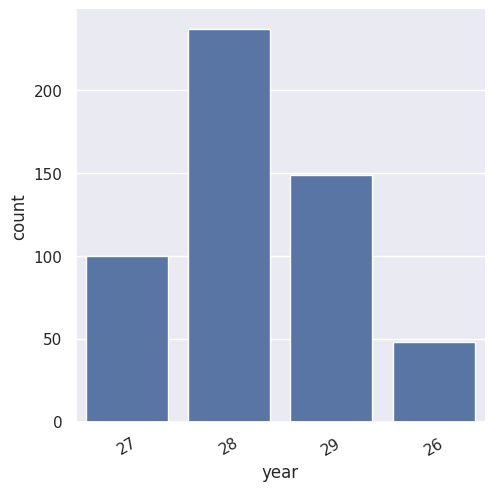
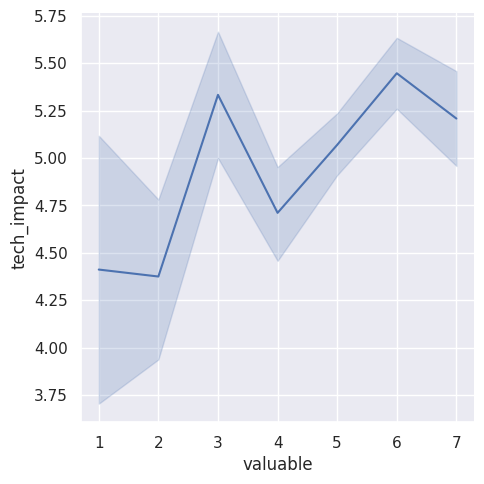

---
# Do not edit the text between these lines!
layout: default
---

# EX09: Data Analysis for Continuous Improvement

## Analysis

Our idea for continous improvement was to change/add examples and applications for post graduate, non-comp sci work, because it would be helpful for the majority of students. To prove this analysis, we used functions: 
1. "read_csv_rows" - to gather and read all data
2. "select" and "head" - to select the columns we are planning on analyzing, which included year, comp_major, major, tech_impact, and valuable
4. "columnar" - to organize our data by counting columns and rows, and providing column names
5. "count" - to total up each entry in each column we wanted
6. "highest_count" - to provide the most common response of each column, and provide that total count

## Graphical Analysis

## Conclusion

Through our analysis using six functions, we found that that the data does support our recomendation. Using the `count` and `highest_count` functions and our graphs, we found that there are way more upperclassman rather than first years, even though it is an introductory course. Also, we found that the majority of students are not computer science majors, and actually the most popular major is Neuroscience, so activites that would target non comp sci majors would be benefical. Furthermore, most students answered "5" for both tech_impact and valuable, which is good but is near the middle. Those scores could be increased if activites were changed to increase interest in the student body by making them more relevant.

To explore this idea further, it might be beneficial to gather data on what career fields students are planning on going into, and analyze how important computer science/coding experience is for those jobs.

A potential cost to changing this feature of the class would be for freshman, especially for freshman who are planning on majoring in computer science, but who don't really have any prior coding experience. They might be looking for guidance in their major with this class, but could find it more difficult if most content is not targeted towards their specific needs.